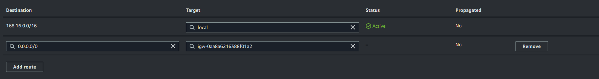

# AWS Solution for an Honest Feedback System

> Created by: Chris Sa  
> Last updated: 2023-01-15

## Table of contents

- [AWS Solution for an Honest Feedback System](#aws-solution-for-an-honest-feedback-system)
  - [Table of contents](#table-of-contents)
  - [Project overview](#project-overview)
  - [Implementation outline](#implementation-outline)
  - [Demonstration video](#demonstration-video)
  - [Files](#files)
    - [Index (frontend)](#index-frontend)
    - [Feedback (backend)](#feedback-backend)
  - [Implementation - Level 1](#implementation---level-1)
    - [Virtual Private Cloud (VPC)](#virtual-private-cloud-vpc)
      - [Create a VPC](#create-a-vpc)
      - [Create subnets](#create-subnets)
      - [Create an internet gateway](#create-an-internet-gateway)
      - [Edit the route table](#edit-the-route-table)
      - [Create DynamoDB endpoint](#create-dynamodb-endpoint)
    - [DynamoDB](#dynamodb)
    - [Identity and Access Management (IAM)](#identity-and-access-management-iam)
      - [Create a policy](#create-a-policy)
      - [Create a role](#create-a-role)
    - [EC2](#ec2)
      - [Creating an EC2 instance](#creating-an-ec2-instance)
      - [Setting up the EC2 instance](#setting-up-the-ec2-instance)
    - [Amazon Machine Image (AMI)](#amazon-machine-image-ami)
    - [Launch Template](#launch-template)
    - [Auto Scaling Group](#auto-scaling-group)

## Project overview

The goal of level 1 is to create a simple feedback system that allows users to submit feedback and view a random piece of feedback. The system should be hosted on AWS and use DynamoDB to store the feedback.

## Implementation outline

## Demonstration video

To see a walkthrough of the project, please click [here](https://www.youtube.com/watch?v=h12FAoD_vNQ).

## Files

For this project PHP was used to create the frontend and backend. The frontend page has a simple form that allows users to submit feedback. The backend is a PHP file that stores the feedback in a DynamoDB table.

Both files need to connect to the database, to do this the following code is used:

```php
require 'vendor/autoload.php';

use Aws\DynamoDb\DynamoDbClient;

$client = DynamoDbClient::factory(array(
    'region' => 'ap-southeast-2',
    'version' => 'latest'
));

$tableName = 'Cotiss-Feedback-DB';
```

The full files can be found in the project's [GitHub repository](https://github.com/JJeeff248/cotiss-project/tree/main/website)

### Index (frontend)

The index file is the main file for the project. It should be structured as follows:

A random piece of feedback should be pulled from the database and displayed at the top of the page. This is done by using the following code:

```php
$response = $client->scan(array(
   'TableName' => $tableName
));

$items = $response->get('Items');

$feedback = $items[array_rand($items)];
```

The form should have the following fields:

- Feedback (text)
- Rating (number)

### Feedback (backend)

The feedback file is the backend file for the project. It should be structured to take the form data from the index file and store it in the database. The following code can be used to store the data:

```php
$response = $client->putItem(array(
   'Item' => array(
      'id' => array('N' => $id),
      'feedback' => array('S' => $feedback),
      'rating' => array('N' => $rating)
   ),
   'TableName' => $tableName
));
```

## Implementation - Level 1

The goal of level 1 is to deploy the feedback system on Auto Scaling EC2 instances.

### Virtual Private Cloud (VPC)

#### Create a VPC

1. Go to the [VPC console](https://console.aws.amazon.com/vpc/home?region=ap-southeast-2#vpcs:).
2. Click "Create VPC".
3. Apply the following settings:
   - VPC only
   - Name (optional)
   - IPv4 CIDR manual input
   - A 16-bit IPv4 CIDR block (e.g. `168.16.0.0/16`)
   - No IPv6 CIDR block
   - Default tenancy


#### Create subnets

1. Go to the [subnets console](https://console.aws.amazon.com/vpc/home?region=ap-southeast-2#subnets:).
2. Click "Create subnet".
3. Select the VPC created in the previous section.
4. Apply the following settings:
   - Name (optional)
   - Availability zone (select one)
   - A 24-bit IPv4 CIDR block (e.g. `168.16.0.0/24`)
5. Click "Add new subnet" to create more subnets. In this example, an additional two availability zones were selected with the following IPv4 CIDR blocks: `168.16.16.0/24` and `168.16.32.0/24`.
6. Click "Create subnet".
7. Ensure you now have three subnets in different availability zones.


#### Create an internet gateway

1. Go to the [internet gateways console](https://console.aws.amazon.com/vpc/home?region=ap-southeast-2#igws:).
2. Click "Create internet gateway".
3. Provide a name for the internet gateway.
4. Click "Create internet gateway".
5. Select "Actions" and then "Attach to VPC".
6. Select the VPC created in the first section.
7. Select "Attach internet gateway".


#### Edit the route table

1. Go to the [route tables console](https://console.aws.amazon.com/vpc/home?region=ap-southeast-2#RouteTables:).
2. Select the route table associated with the VPC created in the first section.
3. Change to the "Routes" tab.


4. Click "Edit routes".
5. Click "Add route".
6. Apply the following settings:
   - Destination: `0.0.0.0/0`
   - Target: Select the internet gateway created in the previous section.
7. Click "Save changes".



#### Create DynamoDB endpoint

1. Go to the [VPC endpoints console](https://console.aws.amazon.com/vpc/home?region=ap-southeast-2#Endpoints:).
2. Click "Create endpoint".
3. Search for "DynamoDB" and select `com.amazonaws.ap-southeast-2.dynamodb`.
4. Select the VPC created in the first section.
5. Select the route table associated with the VPC.
6. Click "Create endpoint".

### DynamoDB

1. Go to the [DynamoDB console](https://console.aws.amazon.com/dynamodb/home?region=ap-southeast-2#tables:).
2. Click "Create table".
3. Enter a table name (e.g. `Cotiss-Feedback-DB`).
4. Enter `id` as the primary key.
5. Select "Number" as the key type.
6. Select "Create table".


### Identity and Access Management (IAM)

#### Create a policy

1. Go to the [IAM console](https://us-east-1.console.aws.amazon.com/iamv2/home?region=ap-southeast-2#/policies).
2. Click "Create policy".
3. Select DynamoDB as the service.
4. Select the following actions:
   - `dynamodb:BacthGetItem`
   - `dynamodb:GetItem`
   - `dynamodb:GetRecords`
   - `dynamodb:Query`
   - `dynamodb:Scan`
   - `dynamodb:BatchWriteItem`
   - `dynamodb:PutItem`
5. Select "Add ARN" for "stream".
   1. Add your region (e.g. `ap-southeast-2`).
   2. Add your table name (e.g. `Cotiss-Feedback-DB`).
   3. Tick the "Any" box for the "Stream label" field.
   4. Click "Add".
6. Select "Add ARN" for "table".
   1. Add your region (e.g. `ap-southeast-2`).
   2. Add your table name (e.g. `Cotiss-Feedback-DB`).
   3. Click "Add".
7. Click "Next: Tags".
   - Add a tag if you wish.
8. Click "Next: Review".
9. Name the policy (e.g. `Cotiss-Feedback-DB-Policy`).
10. Click "Create policy".
11. Open your policy and confirm the JSON is as follows - where `XXXXXXXXXXXX` is your AWS account ID:

    ```json
    {
        "Version": "2012-10-17",
        "Statement": [
            {
                "Sid": "VisualEditor0",
                "Effect": "Allow",
                "Action": [
                    "dynamodb:BatchGetItem",
                    "dynamodb:GetItem",
                    "dynamodb:GetRecords",
                    "dynamodb:Query",
                    "dynamodb:Scan",
                    "dynamodb:BatchWriteItem",
                    "dynamodb:PutItem"
                ],
                "Resource": [
                    "arn:aws:dynamodb:ap-southeast-2:XXXXXXXXXXXX:table/Cotiss-Feedback-DB/stream/*",
                    "arn:aws:dynamodb:ap-southeast-2:XXXXXXXXXXXX:table/Cotiss-Feedback-DB"
                ]
            }
        ]
    }
    ```

#### Create a role

1. Go to the [IAM console](https://us-east-1.console.aws.amazon.com/iamv2/home?region=ap-southeast-2#/roles).
2. Click "Create role".
3. Select "AWS service" as the trusted entity.
4. Select "EC2" as the use case.
5. Click "Next".
6. Select the policy created in the previous section.
7. Click "Next".
8. Provide a name for the role (e.g. `Cotiss-EC2-Role`).
9. Click "Create role".

### EC2

#### Creating an EC2 instance

1. Go to the [EC2 Instances console](https://console.aws.amazon.com/ec2/v2/home?region=ap-southeast-2#Instances).
2. Click "Launch instance".
3. Name the instance (e.g. `Cotiss-EC2-Instance`).
4. Select "Amazon Linux 2 AMI"


5. Select "t2.micro" as the instance type.
6. Click "Create new key pair".
   1. Name the key pair (e.g. `Cotiss-EC2-Key-Pair`).
   2. Keep RSA as the key pair type.
   3. Select the format as laid out below.
      - Windows users: select `.ppk`.
      - Mac/Linux users: select `.pem`.
   4. Click "Create key pair".
   5. Save the key pair file somewhere safe.
7. Ensure your key pair is selected.
8. Click "Edit" under "Network settings".
   1. Select the VPC created in the first section.
   2. Choose a subnet from the list. These should be the subnets created in the second section.
   3. Change the auto-assign public IP setting to "Enable".
   4. Select "Create security group".
      1. Name the security group (e.g. `Cotiss-EC2-Security-Group`).
      2. Add a description (e.g. `Allows SSH and HTTP access`).
      3. Change the SSH source to "My IP".
      4. Click "Add security group rule".
         1. Select "HTTP" as the type.
         2. Select "Anywhere" as the source.
         3. Click "Save rules".
      
9.  Expand the "Advanced details" section.
10. Select the IAM role created in the previous section.
11. Launch the instance.

#### Setting up the EC2 instance

1. Connect to the EC2 instance using SSH.
   - Windows users: use [PuTTY](https://www.putty.org/).
   - Mac/Linux users: use the terminal.
2. Update the instance:
   - `sudo yum update -y`
3. Install Apache and PHP:
   - `sudo yum install -y httpd php`
4. Start Apache:
   - `sudo systemctl start httpd`
5. Enable Apache:
   - `sudo systemctl enable httpd`
6. Confirm Apache is running by visiting the public IP of the instance in a web browser.
7. Transfer your website files to the instance.
   - Windows users: use [WinSCP](https://winscp.net/eng/index.php).
   - Mac/Linux users: use `scp`.
8. Move the website files to the Apache directory:
   - `sudo mv /home/ec2-user/website/* /var/www/html/`
9. Navigate to the Apache directory:
   - `cd /var/www/html/`
10. Run the below commands to install the AWS SDK for PHP:
    - `sudo php -r "copy('https://getcomposer.org/installer', 'composer-setup.php');"`
    - `sudo php composer-setup.php`
    - `sudo php -r "unlink('composer-setup.php');"`
    - `sudo php composer.phar require aws/aws-sdk-php`
11. Confirm the website is working by visiting the public IP of the instance in a web browser and submitting a form.


### Amazon Machine Image (AMI)

1. Go to the [EC2 Instances console](https://console.aws.amazon.com/ec2/v2/home?region=ap-southeast-2#Instances).
2. Select the instance created in the previous section.
3. Stop the instance.
   - Click "Instance State" and then "Stop".
4. Click "Actions" then "Image and templates" and then "Create Image".
5. Enter a name for the image (e.g. `Cotiss-EC2-AMI`).
6. Click "Create Image".

### Launch Template

1. Go to the [EC2 Launch Templates console](https://console.aws.amazon.com/ec2/v2/home?region=ap-southeast-2#LaunchTemplates).
2. Click "Create launch template".
3. Enter a name for the launch template (e.g. `Cotiss-Launch-Template`).
4. Select the AMI created in the previous section under "AMI".


5. Choose "t2.micro" as the instance type.
6. Select the security group created in the previous section.
7. Expand the "Advanced details" section.
8. Select the IAM role created previously.
9. Click "Create launch template".

### Auto Scaling Group

1. Go to the [EC2 Auto Scaling Groups console](https://console.aws.amazon.com/ec2/autoscaling/home?region=ap-southeast-2#AutoScalingGroups).
2. Click "Create auto scaling group".
3. Name the auto scaling group (e.g. `Cotiss-Feedback-ASG`).
4. Select the launch template created in the previous section.
5. Change "Version" to "Latest version".
6. Click "Next".
7. Choose the VPC created in the first section.
8. Select the subnets created under the selected VPC.


9. Click "Next".
10. Select "Attach to a new load balancer".
11. Select "Internet-facing".
12. Change "Default routing" to "Create new".


13. Click "Next".
14. Set desired capacity. This is the number of instances you want to run.
15. Click "Next".
16. Add notifications if required.
17. Click "Skip to review".
18. Confirm the settings are correct.
    - The correct launch template.
    - The correct VPC with subnets.
    - An application load balancer with a target group.
    - The correct capacity numbers.
19. Click "Create auto scaling group".
20. Go to the [EC2 Load Balancers console](https://console.aws.amazon.com/ec2/v2/home?region=ap-southeast-2#LoadBalancers).
21. Copy the DNS name of the load balancer.
22. Paste the DNS name into a web browser and confirm the website is working.


